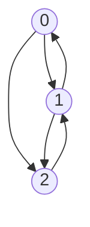

# Technical Design

This document outlines the technical background and design decisions for tinygraph, a library optimized for compact and efficient graphs using succinct data structures.

## Introduction

tinygraph explores the design space of sparse graphs, such as road networks, with a focus on making graphs both compact and efficient for modern hardware.
As computation becomes cheaper, memory remains a significant bottleneck.
tinygraph aims to optimize graphs to fit into random access memory or even the L3 cache using succinct data structure and compression techniques.

This document provides a top-down introduction to graph representations, the design decisions behind tinygraph, and the optimizations used to achieve compactness and efficiency.


## Graph Representations

We use the following graph as a working example below:



### Adjacency List

An adjacency list represents a graph as a collection of linked lists, where each node points to its neighbors.

**Example:**

```
0 -> [1, 2]
1 -> [0, 2]
2 -> [1]
```

Or in Python

```python
g = [list() for _ in range(3)]

g[0].append(1)
g[0].append(2)
g[1].append(0)
g[1].append(2)
g[2].append(1)
```

**Pros:**
1. Simple to implement
2. Good enough for small graphs

**Cons:**
1. High space overhead due to pointer-based lists
2. Poor memory locality, leading to cache misses during traversal
3. Inefficient for large graphs due to random memory accesses


### Adjacency Matrix

An adjacency matrix represents a graph as a binary matrix where `matrix[i][j]` indicates an edge between nodes `i` and `j`.

**Example:**

```
[
  [0, 1, 1],
  [1, 0, 1],
  [0, 1, 0]
]
```

Or in Python:

```python
g = [[0 for _ in range(3)] for _ in range(3)]

g[0][1] = 1
g[0][2] = 1
g[1][0] = 1
g[1][2] = 1
g[2][1] = 1
```

**Pros:**
- Simple and cache-efficient for dense graphs
- Fast edge lookup and traversal

**Cons:**
- Quadratic space complexity, which is impractical for large sparse graphs
- Wasteful for sparse graphs, as most entries are zeros


### Compressed Sparse Row (CSR)

CSR is a memory-efficient representation for sparse graphs.

It stores edges in two arrays:
1. `targets`: The target nodes of edges
2. `offsets`: The starting and ending indices of edges for each source node

**Example:**

```
targets = [1, 2, 0, 2, 1]
offsets = [0, 2, 4, 5]
```

For node `n`, its edges are in `targets[offsets[n] : offsets[n + 1]]`.

**Pros:**
- Efficient for sparse graphs
- Good memory locality and cache performance

**Cons:**
- Difficult to modify once created
- Requires rebuilding the graph for dynamic updates


## Are We Tiny Yet?

tinygraph builds on the CSR representation and introduces additional optimizations to reduce memory usage and improve efficiency.

### Succinct Compressed Sparse Row

tinygraph replaces the `offsets` array with a succinct bit vector.
Each bit indicates the start of a new range in the `targets` array.

**Example:**

```
targets = [1, 2, 0, 2, 1]
offsets = [1, 0, 1, 0, 1, 1]  # bit vector
```

Two key operations enable efficient traversal in succinct data structures
1. `rank(i)`: Counts the number of set bits up to position `i`
2. `select(i)`: Finds the position of the `i`-th set bit

For node `n`, its edges are in `targets[select(n) : select(n + 1)]`.

**Pros:**
- Reduces the size of the `offsets` array
- Maintains efficient traversal using succinct data structures

**Cons:**
- Requires additional overhead for the succinct data structure
- Requires additional overhead for the select operations


### Compress Edge Targets

tinygraph further reduces the size of the `targets` array by:
1. Sorting edge targets to enable delta encoding
2. Using delta encoding to compress consecutive targets
3. Storing delta encoded targets as variable-length integers (varints)

During traversal:
1. Use `select` to find the range of targets for a node
2. Decode the varints to reconstruct deltas
3. Compute absolute values from deltas to get the original targets

**Example:**

```
targets = [0x1, 0x1, 0x0, 0x2, 0x1]  # delta-varint encoded sub-ranges
offsets = [1, 0, 1, 0, 1, 1]  # bit vector
```

### Spatial Locality

To minimize deltas and improve compression, tinygraph spatially reorders nodes.
This ensures that nodes connected by edges are likely to have close ids, reducing delta sizes.

**Techniques:**
1. Space-filling curves: Reorder nodes using a z-order curve to minimize deltas
2. Strongly Connected Components: Reorder nodes to minimize edge deltas

**Example:**

For a road network, spatially close nodes will have close node ids, resulting in smaller deltas and better compression in the delta-varint encoded targets array.


## Conclusion

tinygraph combines the Compressed Sparse Row (CSR) representation with succinct data structures, delta-varint encoding, and spatial reordering to create a compact and efficient graph library.
These optimizations ensure that graphs fit into memory hierarchies (e.g., L3 cache) and run efficiently on modern hardware.
